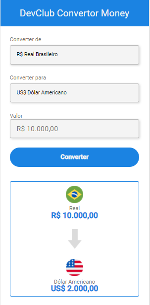

# Projeto conversor de moedas

> Conversor de moedas consumindo API que puxa valores atualizados em tempo real do Dólar e Euro.

##
Tecnologias usadas:
 
<a href="https://developer.mozilla.org/pt-BR/docs/Web/JavaScript" target="blank">JavaScript</a>;
 
<a href="https://developer.mozilla.org/pt-BR/docs/Web/HTML" target="blank">HTML</a>;
 
<a href="https://developer.mozilla.org/pt-BR/docs/Web/CSS" target="blank">CSS</a>;

## 
Colaboradores:

<a href="https://www.linkedin.com/in/kayky-bittencourt-072901245/" target="_blank">Kayky Bittencourt</a>

